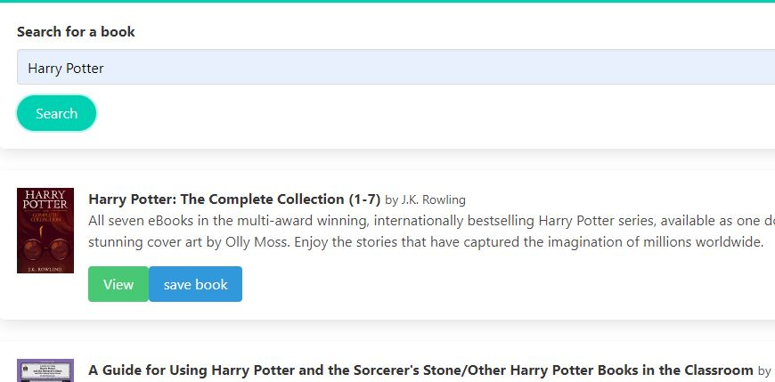

# Reactive Gbooks Search
  

  
  ## Description 
  Another little test app for building up the reactive chops. This one is centered around a lot of starter code for a MERN stack. Using The Google Books API can query a search parameter. The user can scroll through the results and save books to their que, or get more info by viewing on google

  Check out the live app [here](https://react-google-booker.herokuapp.com/)
  ## Table of Contents
  * [Installation](#installation)
  * [Usage](#usage)
  * [Credits](#credits)
  * [License](#license)
  * [Contributions](#contributing)
  * [Tests](#tests)
  
  ## Installation 
  clone the repo. NPM install to get dependencies in both the root and the client side. NPM start to run
  
  ## Usage
  After npm start, visit the site on localhost:3000. Save and remove books from your list at your leaisure
  
  ## Credits
  Thanks to Trilogy for the starter code
  
  ## License
  MIT
  
  ## Contributing
  not at this time
  
  ## Tests
  none
  
  ## Questions
  Have quesitons about this repo? Please reach out on github or via email
  * [clubkemp](https://github.com/clubkemp)
  * kempj2.jk@gmail.com